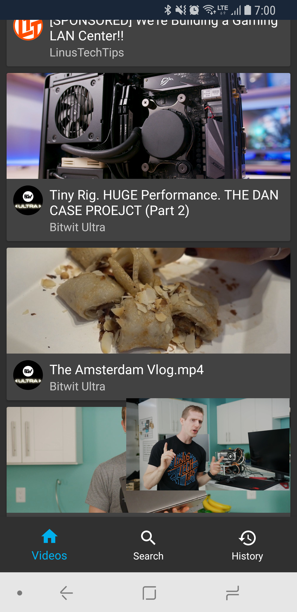

# Pontoon: Unofficial Floatplane Android App

 

  

 

 

An unnoffical Floatplane Club app. Still very much a work in progress. Looking for testers!

## Contributing
Feel free to make a Pull Request and I'll look at it when I get a chance
### Building
  Still working on proper documentation, but right now you need to create a fabric.properties file with `apiKey=0` (or substitute you own)

